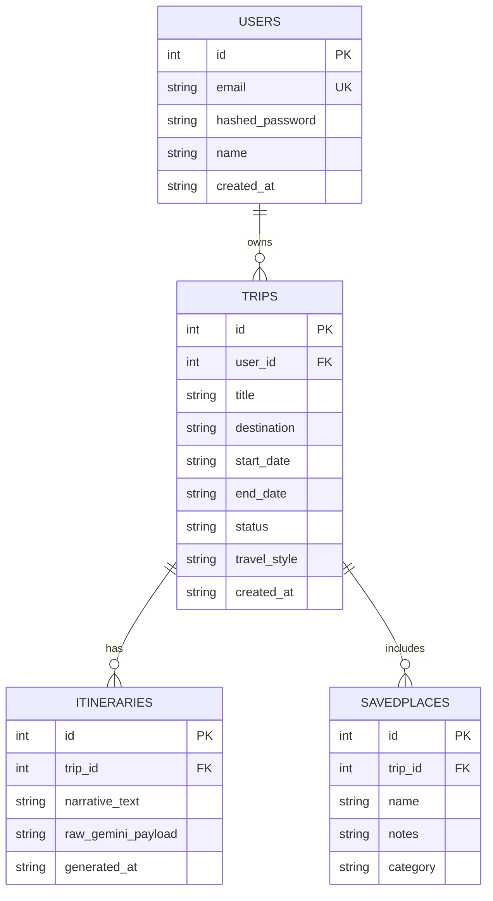

# Voyage

**A slow-travel editorial trip planner** — combining magazine-style travel storytelling with a narrative-driven AI itinerary generator. Instead of a bulleted logistics list, Voyage writes your itinerary the way a thoughtful travel feature would: full of mood, pacing, and reason.

Built as a rapid vibecoding prototype.

---

## ✨ What it does

- **AI Planner** — describe your destination, dates, pace, and travel style, and Voyage generates a full narrative itinerary (day-by-day, written in flowing prose, not a checklist).
- **Regeneration** — not quite right? Regenerate the itinerary with adjusted pace/style until it fits.
- **Saved Trips** — every trip you plan lives in one place, organized into **Drafts**, **Upcoming**, and **Past** sections.
- **Explore feed** — a curated, magazine-style feed of slow-travel destinations, browsable without an account.
- **About / Philosophy** — a static editorial page on what "slow travel" means.
- **Authentication** — secure registration and login with JWT-based sessions; guests can browse Explore/About, but planning and saving trips requires an account.

---

## 🛠 Tech Stack

**Backend**
- **FastAPI** — Python web framework
- **SQLModel / SQLAlchemy** — ORM over a file-based **SQLite** database (no Postgres)
- **Passlib (bcrypt)** — password hashing
- **PyJWT** — JWT session tokens
- **Groq API** (Llama 3.3 70B) — powers the narrative itinerary generation
- **Pydantic** — request/response validation and settings management

**Frontend**
- **React** (Hooks, functional components)
- **Vite** — dev server and build tool
- **Tailwind CSS** — styling, using a custom design-token config
- **React Router v6** — client-side routing, including protected routes
- **Axios** — API client with automatic JWT attachment and 401 handling
- **lucide-react** — icon set

---

## 🎨 Design System — "Editorial Warm Minimalism"

| Token | Value |
|---|---|
| Background | `#FAF6F0` (warm cream) |
| Accent — primary | `#C97B4A` (terracotta) |
| Accent — secondary | `#3A5A40` (deep green) |
| Surface / muted fill | `#E4D5C3` (soft sand) |
| Headline font | Fraunces (serif) |
| UI/body font | Inter (sans-serif) |

Generous whitespace, pill-shaped buttons, rounded cards with soft shadows (no hard borders), and asymmetric magazine-style layouts for editorial content (Explore, About), versus clean card grids for logistics content (Saved Trips, forms).

---

## 📁 Project Structure

```
Voyage/
├── docs/
│   └── Voyage_PRD.md               # Original product requirements document
├── backend/
│   ├── app/
│   │   ├── main.py                # FastAPI app, routers, CORS, startup DB init
│   │   ├── database.py            # SQLite engine + session dependency
│   │   ├── exceptions.py          # Global exception handlers
│   │   ├── core/
│   │   │   ├── config.py          # Loads .env (Groq key, JWT secret, CORS origins)
│   │   │   ├── security.py        # Password hashing, JWT encode/decode
│   │   │   └── dependencies.py    # get_current_user (JWT auth dependency)
│   │   ├── models/                # SQLModel table definitions
│   │   │   ├── user.py
│   │   │   ├── trip.py
│   │   │   ├── itinerary.py
│   │   │   └── saved_place.py
│   │   ├── schemas/                # Pydantic request/response models
│   │   │   ├── user.py
│   │   │   ├── trip.py
│   │   │   └── itinerary.py
│   │   ├── routers/
│   │   │   ├── auth.py             # /auth/register, /auth/login
│   │   │   ├── trips.py            # /trips CRUD
│   │   │   └── itineraries.py      # /trips/{id}/itinerary (+/regenerate)
│   │   └── services/
│   │       ├── gemini_service.py   # Editorial-tone prompt + Groq API call
│   │       └── auth_service.py     # User lookup, credential checks
│   ├── db/
│   │   ├── schema.sql              # Reference SQL schema
│   │   └── ER_DIAGRAM.md           # Mermaid ER diagram
│   ├── seed.py                     # Populates sample data for local dev
│   ├── .env                        # GROQ_API_KEY, JWT_SECRET, CORS_ORIGINS, etc.
│   ├── requirements.txt
│   └── Voyage.db                   # SQLite database file (gitignored)
│
└── frontend/
    ├── src/
    │   ├── main.jsx
    │   ├── App.jsx
    │   ├── router.jsx
    │   ├── api/
    │   │   └── client.js           # Axios instance, JWT + 401 interceptors
    │   ├── context/
    │   │   └── AuthContext.jsx     # Auth state, token validity checks
    │   ├── components/
    │   │   ├── layout/
    │   │   │   ├── Navbar.jsx
    │   │   │   ├── Footer.jsx
    │   │   │   └── PageLayout.jsx
    │   │   ├── common/
    │   │   │   ├── Button.jsx
    │   │   │   ├── Card.jsx
    │   │   │   ├── Logo.jsx
    │   │   │   └── SkeletonLoader.jsx
    │   │   └── ProtectedRoute.jsx
    │   ├── pages/
    │   │   ├── Home.jsx
    │   │   ├── Explore.jsx
    │   │   ├── About.jsx
    │   │   ├── AIPlanner.jsx
    │   │   ├── SavedTrips.jsx
    │   │   ├── Login.jsx
    │   │   └── Register.jsx
    │   ├── assets/images/          # Local destination/hero photography
    │   └── styles/
    │       └── index.css           # Tailwind directives, font imports
    ├── tailwind.config.js
    ├── package.json
    └── .env                        # VITE_API_BASE_URL
```

---

## 🗄 Data Model

**Entities:** `Users`, `Trips`, `Itineraries`, `SavedPlaces`



- `users.email` is unique-constrained.
- Indexes on `trips.user_id` and `itineraries.trip_id`.
- All datetimes stored as ISO8601 strings (SQLite has no native datetime type).
- `raw_gemini_payload` stores the unparsed AI provider response as JSON text, for audit/debugging.

---

## 🔌 Backend API Surface

| Endpoint | Method | Auth | Purpose |
|---|---|---|---|
| `/auth/register` | POST | No | Create account, hash password |
| `/auth/login` | POST | No | Verify credentials, issue JWT |
| `/trips` | GET / POST | Yes | List / create trips |
| `/trips/{id}` | GET / PUT / DELETE | Yes | Manage a single trip |
| `/trips/{id}/itinerary` | GET / POST | Yes | Fetch / generate a narrative itinerary |
| `/trips/{id}/itinerary/regenerate` | POST | Yes | Regenerate (full rewrite or a single section) |

All routes return clean JSON error shapes (`{ error, status_code, message }`) via global exception handlers — no raw tracebacks ever reach the client. Interactive API docs are available at `/docs` (Swagger UI) once the backend is running.

---

## 🔐 Authentication & Security

- Passwords hashed with **bcrypt** via Passlib, never stored or returned in plaintext.
- Sessions use **JWTs** signed with a server-side secret (`JWT_SECRET`), containing the user ID as the subject claim and an expiry.
- The frontend attaches the JWT to every request automatically via an Axios request interceptor.
- A response interceptor catches expired/invalid tokens (401s) globally, clears the stored token, and redirects to `/login` — preserving the originally requested page via a `?redirect=` param so the user lands back where they were after logging in.
- On page load/refresh, the stored token's expiry is checked client-side (by decoding its payload) before trusting it — preventing a flash of "logged in" state on an actually-expired session.
- **Guest vs. registered user roles**: guests can browse Explore and About; AI Planner and Saved Trips are protected routes requiring authentication.

---

## 🤖 AI Itinerary Generation

Itineraries are generated via the **Groq API** (Llama 3.3 70B Versatile), using a system prompt that explicitly instructs an editorial, narrative tone — full sentences and paragraphs organized by day, atmosphere-first openings, sensory detail, and pace/style awareness — rather than a bulleted list.

> Note: the original PRD specified Google's Gemini API. Mid-project, Gemini's free-tier quota was unavailable on the developer's account, so the AI provider was swapped to Groq. The service layer's function names and interface were kept identical, so the swap required no changes to the router or frontend code — only the internals of `gemini_service.py` (filename retained for continuity).

Regeneration supports two modes: a full itinerary rewrite, or patching a single named section while preserving the rest — resolved via an optional `section` parameter.

---

## 🖥 Frontend Highlights

- **Real backend integration from the start** — no mock data; every page (AI Planner, Saved Trips) calls the live FastAPI backend.
- **Loading states everywhere** — skeleton loaders and a custom flying-plane animation during itinerary generation, satisfying the "structured loading state on every async interaction" requirement.
- **Saved Trips** — trips are grouped into Drafts, Upcoming, and Past sections, each with its own empty state.
- **AI Planner result view** — parses the AI's narrative text (which follows a `Day N — Title` convention) into a numbered, editorial-styled day-by-day layout, with a graceful fallback to plain paragraph text if the pattern isn't found.
- **Deep linking** — visiting `/planner?trip={id}` loads that trip's existing itinerary directly, rather than a blank form.

---

## 🚀 Running Locally

**Backend**
```bash
cd backend
python -m venv venv
venv\Scripts\activate        # Windows
source venv/bin/activate     # macOS/Linux
pip install -r requirements.txt
# fill in backend/.env — see .env.example
uvicorn app.main:app --reload
```
API available at `http://localhost:8000`, interactive docs at `http://localhost:8000/docs`.

**Frontend**
```bash
cd frontend
npm install
# fill in frontend/.env — see .env.example
npm run dev
```
App available at `http://localhost:5173`.

**Optional: seed sample data**
```bash
cd backend
python seed.py
```
Creates a demo account (`demo@voyage.app` / `demopass123`) with sample trips, an itinerary, and saved places.

---

## 📝 Environment Variables

**`backend/.env`**
```
GROQ_API_KEY=your_groq_api_key
JWT_SECRET=a_long_random_string
JWT_ALGORITHM=HS256
ACCESS_TOKEN_EXPIRE_MINUTES=60
DATABASE_URL=sqlite:///./Voyage.db
CORS_ORIGINS=http://localhost:5173,http://127.0.0.1:5173
```

**`frontend/.env`**
```
VITE_API_BASE_URL=http://localhost:8000
```

---

## 🧭 Non-Goals (v1)

Multi-user trip collaboration, payments/booking integration, offline mode, and a native mobile app were explicitly out of scope for this prototype.

---

## 📚 Project History

This project was built in five phases:

1. **Requirements** — product requirements document (destinations, user roles, feature matrix, data model).
2. **Database Design** — SQLite schema, ER diagram, keys/indexes/constraints.
3. **Backend** — FastAPI + SQLModel backend built incrementally: config → security → models → schemas → auth → trips → AI itinerary service → global exception handling.
4. **Frontend** — React + Tailwind UI built page-by-page: design tokens → shared components → layout → routing → Home → Explore → About → Login/Register → AI Planner → Saved Trips.
5. **Integration hardening** — session-expiry handling, redirect-aware login, client-side token validity checks, and deployment-ready CORS configuration.

Throughout, each build step was manually verified — via direct Python execution in Phase 3, and via the running Swagger UI (`/docs`) and browser testing in Phases 4–5 — before moving to the next.