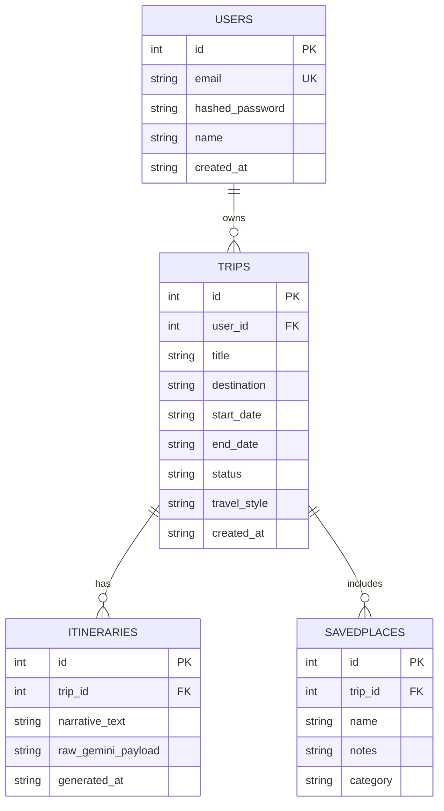

# Voyage — Product Requirements Document (PRD)

> **How to use this file:** Paste this entire document into a new Claude chat (or a Claude Project's "Project Knowledge") before asking for any build step. It is self-contained — Claude should not need anything else to understand the product, stack, design system, or where a given build step fits in the overall plan. Execution prompts for each phase are in Section 10; paste one phase at a time into fresh chats to keep context tight.

---

## 1. Product Overview

**Voyage** is a slow-travel editorial trip planner built as a rapid vibecoding prototype. It combines magazine-style travel storytelling with a narrative-driven AI itinerary generator powered by the Google Gemini API. The product's core differentiator is *tone*: itineraries read like a thoughtfully written travel feature, not a bulleted logistics list.

**Stack:** Python (FastAPI) · SQLite · SQLModel/SQLAlchemy · React (Hooks) · Tailwind CSS · Axios · Google Gemini API (`google-generativeai` SDK)

**Non-negotiable stack rules:**
- No PostgreSQL — SQLite only, file-based, via SQLModel/SQLAlchemy.
- Gemini API key lives in `.env`, loaded server-side only — never exposed to the frontend.
- No partial functions or `// TODO` placeholders in generated code — everything must be production-ready and runnable.
- Explicit exception handling on every backend route; structured loading/fade states on every async frontend interaction.

---

## 2. Design System — "Editorial Warm Minimalism"

| Token | Value |
|---|---|
| Background | `#FAF6F0` (warm cream) |
| Accent — primary action | `#C97B4A` (terracotta) |
| Accent — secondary action | `#3A5A40` (deep green) |
| Surface / muted fill | `#E4D5C3` (soft sand) |
| Text | warm charcoal (not pure black) |
| Headline font | Serif — Playfair Display or Fraunces |
| UI/body font | Sans-serif — Inter |

**Layout rules:**
- Generous whitespace, wide margins, asymmetric magazine-style grids for discovery/editorial content.
- Logistics content (trips, forms, dashboards) uses clean rounded cards, 12–20px radius, `shadow-sm`, no hard borders.
- Buttons are pill-shaped (`rounded-full`), filled terracotta or deep green, white text.
- Generous line-height and letter-spacing on all typography.
- Fully responsive across breakpoints.

Every prompt in Section 10 should re-assert these rules — Claude tends to drift toward generic SaaS UI defaults without repetition.

---

## 3. Functional Requirements

1. **Explore feed** — magazine-style inspiration feed of curated destinations (pull quotes, narrative copy, asymmetric image layout).
2. **AI Planner workspace** — structured prompts (destination, dates, travel style, pace) feed the Gemini API, which returns a narrative, editorial-toned itinerary; user can fine-tune and regenerate sections.
3. **Saved Trips** — timeline/card view of upcoming, past, and draft trips.
4. **About / Philosophy** — static editorial page on the slow-travel philosophy.
5. **Auth** — distinct login and registration flows, JWT-based sessions.

## 4. Non-Functional Requirements

- **Performance:** lightweight local SQLite backend; no heavy joins expected at prototype scale; fast page loads via code-splitting on the frontend.
- **Security:** bcrypt-hashed passwords (Passlib), JWT auth (PyJWT), server-side-only Gemini key, Pydantic validation on every input.
- **Data handling:** SQLite TEXT fields store raw Gemini JSON/narrative payloads; all datetimes stored as ISO8601 strings for SQLite compatibility.
- **Reliability:** global FastAPI exception handlers returning clean JSON error shapes; no unhandled 500s.

## 5. User Roles

| Role | Description |
|---|---|
| Guest | Can browse Explore and About; cannot access AI Planner or Saved Trips |
| Registered User | Full access — plan trips, save itineraries, edit profile |

## 6. User Stories

- As a **guest**, I want to browse the Explore feed without logging in, so I can get inspired before committing to an account.
- As a **registered user**, I want to describe my trip style in the AI Planner, so I get a narrative itinerary instead of a generic list.
- As a **registered user**, I want to fine-tune a generated itinerary (regenerate a section, shift the pace), so the plan actually fits how I like to travel.
- As a **registered user**, I want to see all my trips (draft/upcoming/past) in one organized view, so I don't lose track of plans.
- As a **new visitor**, I want a clear, low-friction registration flow, so signing up doesn't feel like a chore.

## 7. MVP Feature Matrix

| Feature | Priority | Phase |
|---|---|---|
| Auth (register/login, JWT) | P0 | 3, 5 |
| SQLite schema (Users, Trips, Itineraries, SavedPlaces) | P0 | 2 |
| Gemini-powered itinerary generation | P0 | 3 |
| AI Planner UI (prompt → itinerary) | P0 | 4 |
| Saved Trips view | P0 | 4 |
| Explore feed | P1 | 4 |
| About / Philosophy page | P1 | 4 |
| Itinerary regeneration / fine-tuning | P1 | 3, 4 |
| Protected routes + session persistence | P0 | 5 |
| Skeleton/fade loading states | P1 | 5 |

**Non-goals (v1):** multi-user trip collaboration, payments/booking integration, offline mode, mobile app. These may be revisited post-prototype but should not shape v1 architecture decisions.

---

## 8. Data Model

**Core entities:** `Users`, `Trips`, `Itineraries`, `SavedPlaces`



Requirements for Phase 2 (DB design step): primary/foreign keys, unique constraint on `users.email`, indexes on `trips.user_id` and `itineraries.trip_id`, ISO8601 strings for all datetime fields, `raw_gemini_payload` as a TEXT column for the unparsed Gemini JSON response.

---

## 9. Backend API Surface (for Phase 3)

| Endpoint | Method | Auth | Purpose |
|---|---|---|---|
| `/auth/register` | POST | No | Create account, hash password |
| `/auth/login` | POST | No | Verify credentials, issue JWT |
| `/trips` | GET/POST | Yes | List / create trips |
| `/trips/{id}` | GET/PUT/DELETE | Yes | Manage a single trip |
| `/trips/{id}/itinerary` | POST | Yes | Call Gemini service, persist narrative itinerary |
| `/trips/{id}/itinerary/regenerate` | POST | Yes | Regenerate a section with adjusted style params |

Gemini prompt templates in the service layer must explicitly instruct an editorial tone and return structured-but-narrative output suitable for direct display. See Section 10 for the full expected folder layout.

---

## 10. Project Folder Structure

Two separate repos/folders, kept independent so the backend can be run and tested (via `/docs`) before the frontend exists.

```
backend/
├── app/
│   ├── main.py                # FastAPI app, router registration, CORS
│   ├── database.py            # SQLite engine + session dependency
│   ├── core/
│   │   ├── config.py          # loads .env (Gemini key, JWT secret)
│   │   └── security.py        # password hashing, JWT encode/decode
│   ├── models/                # SQLModel table definitions
│   │   ├── user.py
│   │   ├── trip.py
│   │   ├── itinerary.py
│   │   └── saved_place.py
│   ├── schemas/                # Pydantic request/response models
│   │   ├── user.py
│   │   ├── trip.py
│   │   └── itinerary.py
│   ├── routers/
│   │   ├── auth.py             # /auth/register, /auth/login
│   │   ├── trips.py            # /trips CRUD
│   │   └── itineraries.py      # /trips/{id}/itinerary(+/regenerate)
│   ├── services/
│   │   ├── gemini_service.py   # editorial-tone prompt + Gemini call
│   │   └── auth_service.py     # user lookup, credential checks
│   └── exceptions.py           # global exception handlers
├── .env                        # GEMINI_API_KEY, JWT_SECRET
├── requirements.txt
└── Voyage.db                  # generated SQLite file, gitignored

frontend/
├── public/
├── src/
│   ├── main.jsx
│   ├── App.jsx
│   ├── router.jsx
│   ├── api/
│   │   └── client.js           # Axios instance, JWT + error interceptors
│   ├── context/
│   │   └── AuthContext.jsx     # session state across the app
│   ├── components/
│   │   ├── layout/
│   │   │   ├── Navbar.jsx
│   │   │   └── Footer.jsx
│   │   ├── common/
│   │   │   ├── Button.jsx
│   │   │   ├── Card.jsx
│   │   │   └── SkeletonLoader.jsx
│   │   └── ProtectedRoute.jsx
│   ├── pages/
│   │   ├── Home.jsx
│   │   ├── Explore.jsx
│   │   ├── AIPlanner.jsx
│   │   ├── SavedTrips.jsx
│   │   ├── About.jsx
│   │   ├── Login.jsx
│   │   └── Register.jsx
│   └── styles/
│       └── index.css           # Tailwind directives, font-face imports
├── tailwind.config.js
├── package.json
└── .env                         # VITE_API_BASE_URL
```

**Which phase builds what:**
- Phase 2 → the schema behind `backend/app/models/`
- Phase 3 → all of `backend/` except `.env` values (you supply the actual Gemini key and JWT secret)
- Phase 4 → `frontend/src/pages/`, `components/`, `styles/`, `tailwind.config.js`
- Phase 5 → `frontend/src/api/`, `context/`, `ProtectedRoute.jsx`, and wiring `router.jsx`

---

## 11. Step-by-Step Execution Plan

Each phase below is designed to be pasted as a fresh prompt into a **new chat that already has this PRD as context**. Do the phases in order — each depends on the previous phase's output.

### Phase 1 — Requirements (reference only, already done)
This PRD *is* the output of Phase 1. No prompt needed — just carry this document forward.

### Phase 2 — Database Design
> Paste: *"Acting as a Senior Database Architect, design the SQLite schema for Voyage per Section 8 of the attached PRD. Output a Mermaid ER diagram, SQLite-compatible CREATE TABLE statements with keys/indexes/constraints, and a short explanation of each relationship."*

### Phase 3 — Backend APIs
> Paste: *"Acting as a Senior Backend Engineer, build the FastAPI + SQLModel backend for Voyage using the schema from Phase 2 and the API surface in Section 9 of the attached PRD. Include JWT auth (Passlib + PyJWT), the Gemini AI service with editorial-tone prompting, Pydantic validation, and global exception handling. Output the folder structure and complete runnable code for auth, trips, and the Gemini service."*

### Phase 4 — Frontend UI
> Paste: *"Acting as a Senior React Developer, build the Voyage frontend per Section 2 (design system) and Section 3 (functional requirements) of the attached PRD. Use React + Tailwind + React Router. Output the layout wrapper, navigation, and the Home, Explore, AI Planner, and Saved Trips pages, fully styled to the Editorial Warm Minimalism system."*

### Phase 5 — Connect Frontend & Backend
> Paste: *"Acting as a Full Stack Engineer, integrate the Phase 4 frontend with the Phase 3 backend. Output a centralized Axios client with JWT interceptors, an AuthContext, a ProtectedRoute wrapper, and skeleton/fade loading states for the Gemini itinerary generation call, matching the calm editorial aesthetic."*

---

## 12. Open Questions

- Image sourcing for the Explore feed — stock library, user uploads, or Gemini-generated descriptions only? *(design, non-blocking)*
- Should itinerary regeneration replace the full narrative or patch a single section? *(engineering, blocking for Phase 3 prompt design)*
- Any target device priority (desktop-first vs. mobile-first) for the initial prototype? *(design, non-blocking)*