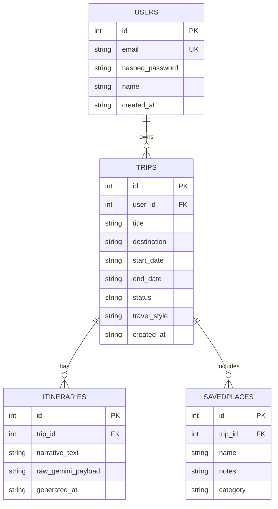

**Core entities:** `Users`, `Trips`, `Itineraries`, `SavedPlaces`

Requirements for Phase 2 (DB design step): primary/foreign keys, unique constraint on `users.email`, indexes on `trips.user_id` and `itineraries.trip_id`, ISO8601 strings for all datetime fields, `raw_gemini_payload` as a TEXT column for the unparsed Gemini JSON response.